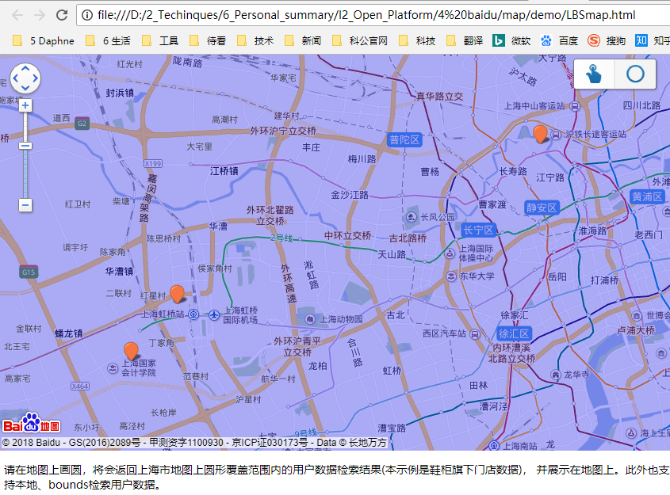

# baiducloud 百度开放地图 ------  chapter-02-02

		入门指南
		查找附近门店实例
			将门店上传LBS云存储
			编写附近门店页面


## 入门指南 

官网地址：http://lbsyun.baidu.com/

开发流程：

`注册百度账号  -> 申请为百度开发者  -> 通过创建应用，获取服务密钥(ak)  -> 使用相关服务功能`


### 通过创建应用，获取服务密钥(ak)

百度开放平台 -> 控制台 -> 新建应用

应用类型可以选择浏览器类型(应用于页面)，和服务器类型(应用于APP)，

设置白名单，可先填写 (*) 表示所有服务器都可以访问。上生产环境时，需要进行白名单的限制

想要及时了解更多信息，可以关注公众号：百度开放平台

详细内容，请查看官网文档


下面我们将通过一个实例来了解百度地图的开发

## 查找附近门店实例

业务需求：用户能按手机，PC自动定位地址，然后以定位为中心，检索附近的门店。

技术实现：利用LBS云存储，存放门店数据，通过JavaScript api 来检索门店，并展示到页面上。

### 将门店上传LBS云存储

LBS云地址： http://lbsyun.baidu.com/index.php?title=lbscloud

LBS云存储平台：http://lbsyun.baidu.com/data/v4/entry

#### 定义表属性


定义表属性


info_type 要设置为检索栏位，后面在检索时会自动匹配。

#### 整理数据并上传导入


先下载模版，然后整理好数据后，在上传到LBS云存储。


```
coord_type
用户上传的坐标的类型：1、2、3、4
uint32
必选
1：GPS经纬度坐标
2：国测局加密经纬度坐标
3：百度加密经纬度坐标
4：百度加密墨卡托坐标
```

经纬度坐标栏位，需要调用web api 接口 

地址编码接口来实现，将地址转换为百度加密经纬度坐标数据。

```

http://api.map.baidu.com/geocoder/v2/?address=上海市普陀区澳门路168号2楼&output=json&ak=*******LPbBT58lQwWcsxS7slV

```

返回值
```
{
    "status": 0,
    "result": {
        "location": {
            "lng": 121.45215447216389,
            "lat": 31.25466474251451
        },
        "precise": 1,
        "confidence": 80,
        "level": "道路"
    }
}
```

更多栏位，请查看LBS 云服务的服务文档

门店数据上传到LBS的表以后我们，就可以进行页面的开发

也可以通过接口来上传数据，参考LBS云服务的服务文档

http://api.map.baidu.com/geodata/v3/poi/create // POST请求


#### 数据导出
查看已上传成功的数据，可使用postman来调用接口

http://api.map.baidu.com/geodata/v3/poi/list?ak=ak值&geotable_id=193530&page_index=0&page_size=10

更多 **LBS 云服务接口** ，查看官网

### 编写附近门店页面


在开发下面代码之前，需要学习下javascript api

http://lbsyun.baidu.com/index.php?title=jspopular/guide/search

src/Lbsmap.html
```
<!DOCTYPE html>
<html>
<head>
	<meta http-equiv="Content-Type" content="text/html; charset=utf-8" />
	<meta name="viewport" content="initial-scale=1.0, user-scalable=no" />
	<style type="text/css">
		body, html {width: 100%;height: 100%;margin:0;font-family:"微软雅黑";}
		#allmap{width:100%;height:500px;}
		p{margin-left:5px; font-size:14px;}
	</style>
	<script type="text/javascript" src="http://api.map.baidu.com/api?v=2.0&ak=*******LPbBT58lQwWcsxS7slV"></script>
	<!--加载鼠标绘制工具-->
	<script type="text/javascript" src="http://api.map.baidu.com/library/DrawingManager/1.4/src/DrawingManager_min.js"></script>
	<link rel="stylesheet" href="http://api.map.baidu.com/library/DrawingManager/1.4/src/DrawingManager_min.css" />
	<title>圆形区域搜索用户数据</title>
</head>
<body>
	<div id="allmap"></div>
	<p>请在地图上画圆，将会返回上海市地图上圆形覆盖范围内的用户数据检索结果(本示例是鞋柜旗下门店数据)，
	并展示在地图上。此外也支持本地、bounds检索用户数据。</p>
</body>
</html>
<script type="text/javascript">
	// 百度地图API功能
	var map = new BMap.Map("allmap"); // 创建地图实例
	var point = new BMap.Point(121.182329, 31.153056); // 创建点坐标
	var options = {
		renderOptions: {
			map: map
		},

		onMarkersSet : function(pois) {
            console.log("asushiye test -----------------------------");
			console.log(pois.length);
		},
		pageCapacity : 100
	};
	var localSearch = new BMap.LocalSearch(map, options);
	map.addEventListener("load", function() {
		var circle = new BMap.Circle(point, 40000, {
			fillColor: "blue",
			strokeWeight: 1,
			fillOpacity: 0.3,
			strokeOpacity: 0.3
		});		
		map.addOverlay(circle);
		localSearch.searchNearby('鞋柜旗下门店', point, 40000, {
			customData: {
				geotableId: 193530
			}
		});
	});
	map.centerAndZoom(point, 12); // 初始化地图，设置中心点坐标和地图级别
	map.enableScrollWheelZoom();
	map.addControl(new BMap.NavigationControl()); //添加默认缩放平移控件

	var drawingManager = new BMapLib.DrawingManager(map, {
		isOpen: false, //是否开启绘制模式
		enableDrawingTool: true, //是否显示工具栏
		drawingToolOptions: {
			anchor: BMAP_ANCHOR_TOP_RIGHT, //位置
			offset: new BMap.Size(5, 5), //偏离值
			scale: 0.8, //工具栏缩放比例
			drawingModes: [
				BMAP_DRAWING_CIRCLE
			]
		}
	});
	var circle = null;
	drawingManager.addEventListener('circlecomplete', function(e, overlay) {
	//	circlecomplete
	    map.clearOverlays();
		circle = e;
		map.addOverlay(overlay);		
		var radius = parseInt(e.getRadius());
		var center = e.getCenter();
		drawingManager.close();
		localSearch.searchNearby('鞋柜旗下门店', center, radius, {
			customData: {
				geotableId: 193530
			}
		});
	});
</script>

```

修改ak值为你申请的服务密钥




更多详细功能，请查看 src/bmap.html 代码