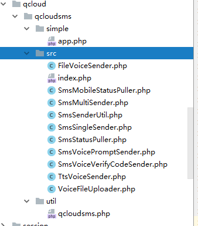

# qcloudsms-php

		腾讯云短信开发指南
		整合短信SDK代码
		编写demo代码
		
## 腾讯云短信开发指南


腾讯云短信接口开发前，需要完成三个事情：

1. 创建应用
2. 设置签名
3. 短信正文模板

创建应用获取appid 和appserect

短信内容配置，配置签名和短信正文模板

配置签名
```
160659	
宝履科技
```
签名配置完成，需要等待审核

短信正文模板
```
173934		
新客户预约，客户：{1} ；{2} ；预约时间：{3} ；地址：{4}。	
```

```
173921		
感谢您预约Weshoes鞋履定制服务，我们的销售顾问将会与您联系，并上门为您服务！ 销售顾问：{1} ； 联系方式：{2}。
```

这里我们配置两个正文模板，签名审核通过后，模板5分钟自动审核


## 整合短信SDK代码

下载最新代码：https://github.com/qcloudsms/qcloudsms_php

整合目录：



将src代码考入src中，将simple代码拷贝到simple中

编写核心代码

/qcloudsms/util/qcloudsms.php
```
<?php
/**
 * Created by PhpStorm.
 * User: Administrator
 * Date: 2018/8/13
 * Time: 16:54
 * common: cloud.tencent sms https://github.com/qcloudsms/qcloudsms_php
 */

require __DIR__ . "/../src/index.php";

use Qcloud\Sms\SmsSingleSender;
use Qcloud\Sms\SmsMultiSender;
use Qcloud\Sms\SmsVoiceVerifyCodeSender;
use Qcloud\Sms\SmsVoicePromptSender;
use Qcloud\Sms\SmsStatusPuller;
use Qcloud\Sms\SmsMobileStatusPuller;

use Qcloud\Sms\VoiceFileUploader;
use Qcloud\Sms\FileVoiceSender;
use Qcloud\Sms\TtsVoiceSender;


class ModelMessageQcloudsms
{

    protected $appid = 140**;
    protected $appkey = "ed9a**";
    protected $smsSign = "宝履科技";

    /**
     * 指定模板单发
     *
     * 普通单发需明确指定内容，如果有多个签名，请在内容中以【】的方式添加到信息内容中，否则系统将使用默认签名。
     *
     * @param string $phoneNumber 不带国家码的手机号
     * @param int    $templId     模板 id
     * @param array  $params      模板参数列表，如模板 {1}...{2}...{3}，那么需要带三个参数
     * @param string $extend      扩展码，可填空串
     * @param string $ext         服务端原样返回的参数，可填空串
     * @return string 应答json字符串，详细内容参见腾讯云协议文档
     *                 {"result":0,"errmsg":"OK","ext":"","sid":"8:1yxdCMWN0bpmDVxcQoF20180813","fee":1}
     *                 {"result":1014,"errmsg":"package format error, template params error","ext":""}
     *
     */

    public function SmsSingleByTemplate($phoneNumber, $templId=0, $smsParams, $extend = "", $ext = "")
    {
        try {
            $ssender = new SmsSingleSender($this->appid, $this->appkey);
            $result = $ssender->sendWithParam("86", $phoneNumber, $templId, $smsParams, $this->smsSign, $extend , $ext);
            return $result;
        } catch (\Exception $e) {
            return json_encode(array("result"=>9999, errmsg=>$e));
        }
    }
    /**
     * 指定模板群发
     *
     *
     * @param  array  $phoneNumbers 不带国家码的手机号列表
     * @param  int    $templId      模板id
     * @param  array  $params       模板参数列表，如模板 {1}...{2}...{3}，那么需要带三个参数
     * @param  string $extend       扩展码，可填空串
     * @param  string $ext          服务端原样返回的参数，可填空串
     * @return string 应答json字符串，详细内容参见腾讯云协议文档
     * {"result":0,"errmsg":"OK","ext":"","detail":
     * [{"result":0,"errmsg":"OK","mobile":"15692198190","nationcode":"86","sid":"8:WKy6k5J4UBrdf9sZkkM20180813","fee":1},
     * {"result":0,"errmsg":"OK","mobile":"13795467304","nationcode":"86","sid":"8:GdEjvS766zAhn6Sn0ua20180813","fee":1}]}
     */

    public function SmsMultiByTemplate($phoneNumbers, $templId=0, $smsParams, $extend = "", $ext = "")
    {
        try {
            $msender = new SmsMultiSender($this->appid, $this->appkey);
            $result = $msender->sendWithParam("86", $phoneNumbers, $templId, $smsParams,  $this->smsSign, $extend , $ext);
            return $result;
        } catch (\Exception $e) {
            return json_encode(array("result"=>9999, errmsg=>$e));
        }
    }

}
```


## 编写demo代码

/qcloudsms/simple/app.php
```
<?php

require __DIR__ . "/../src/index.php";

echo __DIR__;

// 短信应用SDK AppID  AppKey
$appid = 140**; // 1400开头
$appkey = "ed9a**";

// 需要发送短信的手机号码逗号隔开
$phoneNumbers = array("137954673**","156921981**");
$phoneNumbers1 = "13795467304";

// 短信模板ID，需要在短信应用中申请
$templateId = 173139;  // NOTE: 这里的模板ID`7839`只是一个示例，真实的模板ID需要在短信控制台中申请

// 签名
$smsSign = "宝履科技"; // NOTE: 这里的签名只是示例，请使用真实的已申请的签名，签名参数使用的是`签名内容`，而不是`签名ID`

require_once(dirname(FILE)."/../util/qcloudsms.php");

$params = array("4", "ddf", "3", "4");
$ssender = new ModelMessageQcloudsms;

//$return = $ssender->SmsSingleByTemplate($phoneNumbers1, $templateId,$params);

//echo var_dump($return);
echo "SmsSingleByTemplate";

$return = $ssender->SmsMultiByTemplate($phoneNumbers, $templateId,$params);

echo var_dump($return);
echo "SmsMultiByTemplate";

```

执行这个测试代码，进行测试。

